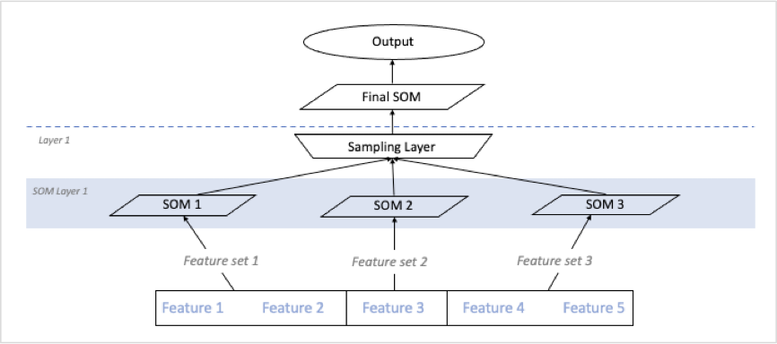

# Modular Self Organising Map

This repo explores the implementation of a multi-facetted multi-layer self organising map, referred to as a modular self organising map (MSOM). Building further on the already implemented deep self organising map by allowing the algorithm to be updated with further capability without the need for extensive retraining.

The MSOM has taken some inspiration from the DSOM implementation proposed by Liu, Nan, Jinjun Wang, and Yihong Gong. The basic principal of this framework being that subsections of an overall feature set are used to train a SOM dedicated to that region. This output is used to create a sampling layer that is an abstraction of the lower-level features. This sampling layer is subsequently fed into either another layer of SOMs or a final SOM which produces a final output. The MSOM takes this inspiration from the DSOM framework expands on it and applies it to a non-image based dataset. Principally, it enables the seamless addition of modular SOM’s trained on unseen and current features to the pretrained MSOM structure. The MSOM framework has several key elements. The definition of feature sets, a formalised SOM training process,  the process for the construction of sampling layers, the sampling method, and the method used for evaluating the overall performance.

## The MSOM process

The aforementioned elements are all used in conjunction to form a larger process. This process has 4 key steps as shown in 

figure 1.1

1) Define feature set
2) Train SOM layer
3) Create sampling layer
4) Train final SOM

Figure 1.1 – High level MSOM framework

The process starts with the user defining the featuresets that will be used for each layer. For layer n+1 featuresets can be built by features that are created from the  preceding layer or unadulterated features from the original data. Once the feature sets have been defined the “train SOM layer” process is undertaken, it is used with the initial feature set and the training data. As mentioned above this function trains a SOM based on the given input data and a specified feature set. This enables a SOM to be trained for each region of the given input data, the output will contain a trained SOM for each of the feature sets provided. When constructing a multi-layer MSOM it is important to note this trained SOM layer’s index in the overall hierarchy of the MSOM. The trained SOM layer is then passed with the respective feature set and training data to the “create sampling layer” function. This function extracts coordinants for the winning node for each result along with the distance from the observation to that node. It records the data in a data table using the feature set as the column header. This is returned from the function as the sampling layer. The data from the sampling layer can then either be passed with new defined feature sets to a new SOM layer or it can be passed to a final layer SOM to produce an output. 
If the user opts to pass the information through a new SOM layer without the introduction of unseen data, the only additional information needed is the new feature sets. The user then follows the process outlined above for as many cycles with differing feature sets as desired until a final output is desired where a final SOM is trained on the output of the final sampling layer as seen in figure 1.2 below.

### Adding new modular components

The user also has the option to expand the sampling layer to include unseen data at any level in the hierarchy of the MSOM. The introduction of unseen data creates a network of SOM’s that need to be managed by the framework. The original and main SOM network is referred to as the Trunk Module while all additional SOM networks added post initial construction are referred to as Branch Modules. 
To add additional Branch Modules to the Trunk Module the data for said modules must be processed through its own pipeline. The data must pass through a train SOM layer to create the module that is to be appended to the Trunk Module. Due to the method used to pass SOM elements through the layers the new branch simply needs to be appended to the given level elected by the user. This is as simple as adding the newly trained module to the dictionary for that given SOM layer and updating the featureset for the given layer. The sampling layer above that then needs to be re processed to integreate the new Branch into the overall structure. This data can then either be passed through further layers or to a final SOM to create an output. This process can be seen in figure 1.3 below. 

Figure 1.3 – Multi branch MSOM

### Layer Sampling Methodologies Proposed

To ensure that the information generated at each SOM level is passed to the subsequent layers in the most information rich manner possible a number of layer sampling methodologies were originally proposed for evaluation. Each methodology offers strengths and weaknesses and this has been taken into account when evaluation was undertaken. There were three broad categories of location evaluate coordinant location, derrived node value, and the entire map as a vector. For each of these methods the winning neuron for a given observation is the core information piece. The winning neuron is determined by finding the neuron with the smallest distance from the given observation. The methods described determine what other information is passed with the winning neuron and how that information is passed.

#### Coordiant location  

The coordinant location uses the x,y coordinant of the winning neuron in the SOM map. This method has also been expanded to include the distance from the observation to the winning neuron, giving  . This method is desierable as it appears to adequately convey the winning neurons position within the overall map as well as providing the observations relation to that position by including the distance. However, due to the extreme values possible within the x and y coorditnants and the relatively small value often produced for the distance metric information loss may occour.

#### Derrived node value  

Similar to the coordinant location this method uses the x,y coordinant of the winning neuron in the SOM map however it then transforms this into a single didget value using the max y value of the SOM map  . This method can also be supplemented with the distance from the winning node to the observation to increase information. This method allows a simple intiger value to be passed between layers reducing overall algorythim complexity. However, due to the multi dimensionality of a SOM map information loss may occour by applying this formula.

#### Entire map vector  

The entire map vector looks to eliminate all potential information loss by passing the entire SOM map with the winning node location flagged as a single vector. The winning node location is determined by finding the max y value for SOM k and the winning node j’s x,y coordingants and then applying the following formula to determine the index value, in which a flag is inserted in a vector of 0’s who’s length is determined by . This vector is passed in its entierety. A variation of this is also proposed whereby the flag value is replaced by the distance from the observation to the winning node. The main drawback of this method is the potential size of vectors that may be passed having to have an entry for each coordinant in the SOM. 